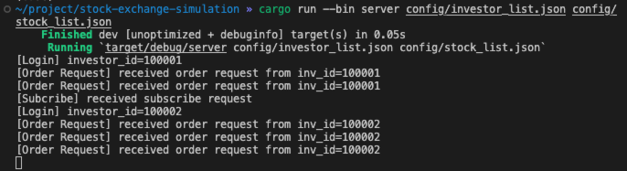

# Stock Exchange Simulation Project


## Project Overview

This project is a simulation of a stock exchange server, designed and implemented in Rust. It uses `tonic`-based gRPC to handle requests and manage connections. The project includes a server for processing requests, investor clients for sending orders, and subscribers for receiving market data.

### Key Features:

- **Stock Exchange Server**: Accepts and processes RPC requests, logs activities to the console.
- **Investor Client**: Tests server connections through RPC, reads instructions from a file and sends them as RPC order requests.
- **Subscriber Client**: Subscribes to the server for market data, receives historical and incremental events.


## System Design

### Server Components:

- **bin_server**: Entrypoint to start the server.
- **server**: Manages RPC connections and processes requests via the submodule portal.
- **portal**: Core logic processor for every request, outputs tasks for server dispatch.
- **orderbook_manager**: Manages an order book for each ticker.
- **event_history**: Manages event logs.
- **order_info**: Manages order details.
- **account_manager**: Manages a list of investors' accounts.
- **stock_manager**: Manages static stock information.

### Investor and Subscriber Clients

- The investor client is used for testing server connections and sending pre-set instructions.
- The subscriber client receives market data feed from the server.


## Usage Instructions

To start a new server:

```bash
$ cargo run --bin server <investor config file> <stock list file>
```

To start a new subscriber:

```bash
$ cargo run --bin subscriber
```

To start an investor tester:

```bash
$ cargo run --bin investor <investor instructions>
```


## Testing

Unit tests are implemented for `orderbook`, `order_info`, and `event_history`. To test the system, run the server, investor, and subscriber clients in separate terminals.


## Workflow Overview

The Stock Exchange Simulation project is structured to mimic real-world stock exchange operations, focusing on the following workflow:

1. **Server Initialization**:
   - The `StockExchangeServer` initializes with a predefined list of stocks and investors.
   - It launches two primary RPC services: `SendOrderService` for processing investor orders and `SubscribeService` for managing market data subscriptions.
2. **Request Processing**:
   - Upon receiving a `RpcXXXRequest`, the server parses it into a corresponding `PortalRequest` and forwards it to the `Portal`.
   - The `Portal` handles the request using its various components like `Orderbook`, `EventHistory`, `AccountManager`, `StockManager`, and `OrderInfo`.
3. **Order Handling**:
   - New orders (`NewOrderRequest`) and order cancellations (`CancelOrderRequest`) are validated and processed through the `Orderbook`.
   - Generated `OrderbookLog` entries are converted into `PortalTasks` for state updates across `EventHistory`, `AccountManager`, and `OrderInfo`.
4. **Response Generation**:
   - The server processes `PortalTasks` and converts them into appropriate `RpcXXXResponse` messages, which are then dispatched to the relevant investor or subscriber sessions.


## Specifications

### Key Assumptions and Rules

- **Investor Sessions**: Multiple logins to the same account are prevented, with new requests being rejected if an account is already active.
- **Market Orders**: It is assumed that market orders do not rest on the order book.
- **Stock Uniqueness**: Each stock ticker is unique within this exchange.
- **Order Processing**: Orders are assumed to have integer sizes and lot sizes. Market buy orders are matched with the most competitive (lowest) sell orders available, subject to investor's cash balance.

### Potential Issues and Considerations

- **Precision of Prices**: The use of `f32` for representing prices may lead to precision issues in certain scenarios.


# Use Case

Run these commands in seperate terminals:

- start a server

  

- start an investor client running Alice's instructions

  

- start a subscriber client

  

- start another investor client running Bob's instructions

  
